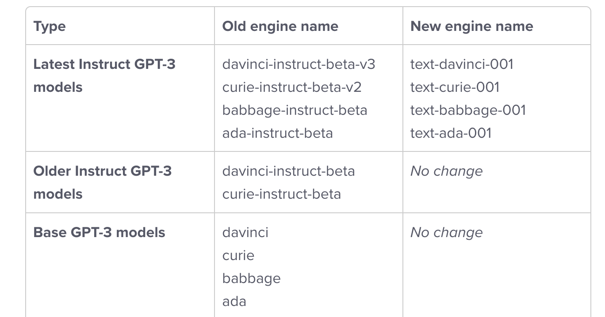

# chatgpt-desc
chatgpt实践经验

#### 1、事情经过

这段时间在研究智能聊天机器人的需求，对聊天机器人的期望是能了解语义，理解沟通者提出的问题，并做流畅合理的回答，沟通过程中还能记录历史对话作为回答的语料，对标最近很火的chatgpt来想就知道老板想要什么效果。chatgpt固然很强大，原始训练有丰富的样本，但是对标自己公司的业务还是有盲点的。所以需要在chatgpt的基础上加入自己公司的语料内容微调模型，刚好openai文档上有这个功能fine-tuning就兴奋的试了一起来，从ada -> babbage -> curie -> davinci这四种base模型的基础上加入自己公司的训练样本进行微调，最后发现效果都不行，模型表现的效果是很傻，呆呆的，不理解语义，只会从样本问答对中提取固定的回答，不会自己组织语言，看起来是根据训练时的文本标识去找固定的答案，跟chatgpt表现的效果天差地别。一开始以为是样本格式的问题，因为openai文档关于fine-tuning的样本模版有很多种，都试了一遍发现还是不行，后来才发现原来想要达到chatgpt的效果根本不能用这个fine-tuning，而要用text-davinci-003模型加向量搜索背景内容进行嵌入的模式，且看下面讲解来龙去脉。

#### 2、chatgpt的模型历史

1、text-davinci-003是2022年最新版的基于指令的gpt-3模型，英文：Instruct GPT-3 models，这个能根据用户的指令进行场景代入，所谓指令就是输入的prompt里面用户有要求模型怎么回答问题，你要当一个老师还是一个学生或者是一个科学家。这个模型是不能用于微调（目前还没开放）的，跟davinci基础模型有很大区别，text-davinci-003的prompt能输入4096个token，而davinci只能输入2048个token，一个中文占两个token。text-davinci-003能阅读理解，理解语义，可以作出类似人类的回答

2、fine-tuning开放的a、b、c、d用于微调的基础模型是2020开源的老版本Base GPT-3 models，这些模型是不懂用户输入的指令的，即不会角色扮演，也不能对用户输入的文本进行阅读理解作出类似人类的回答

3、网页chatgpt是基于text-davinci-003的再升级版，即chatgpt3.5模型，估计是融合了一个强大的在线计算程序实时推导

原文：[https://help.openai.com/en/articles/5832130-what-s-changed-with-engine-names-and-best-practices](https://help.openai.com/en/articles/5832130-what-s-changed-with-engine-names-and-best-practices)

#### 3、官方推荐的方案

1、使用text-davinci-003模型，并优化prompt输入，具体是当一个问题进入模型时把这个问题应该对应的背景资料也一起拼好，然后输入模型，模型是能理解输入的背景并很好的问答这个问题

2、背景资料怎么跟问题匹配呢，假设你有1000条背景资料，当一个用户的问题来了，需要想把这个问题转为向量Embeddings，然后你的背景资料得先初始化好把1000条背景资料对应的向量先提前转化好存着， 一个问题向量来了需要跟1000条向量一一比对，余弦距离算出后，根据自己的需求取相识度最高的N条，把相似度最高的背景资料取出和问题一起输入模型

3、当然了prompt输入的时候格式是有讲究的，具体那种格式最好，看下篇博文openai prompt最佳实践

4、官方有提供在线调试prompt输入并得到completions回答，把注册的key放进去就能调用，自己可以在线调试那种格式的prompt适合自己[https://gpttools.com/comparisontool?from_wecom=1](https://gpttools.com/comparisontool?from_wecom=1)

5、问题转向量并且跟背景资料向量组对比这个代码官方是有提供python脚本的，具体可以看下代码链接，下下篇博文将会具体讲解一下这份代码

原文：[https://help.openai.com/en/articles/6643167-how-to-use-openai-api-for-q-a-and-chatbot-apps](https://help.openai.com/en/articles/6643167-how-to-use-openai-api-for-q-a-and-chatbot-apps)

向量对比代码：[https://github.com/openai/openai-cookbook/blob/main/examples/Question\_answering\_using_embeddings.ipynb](https://github.com/openai/openai-cookbook/blob/main/examples/Question_answering_using_embeddings.ipynb)

官方推荐方案的一些注意事项，可以看作是高级教程：[https://help.openai.com/en/articles/6824809-embeddings-frequently-asked-questions](https://help.openai.com/en/articles/6824809-embeddings-frequently-asked-questions)
